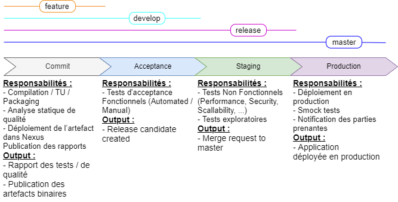

## Jenkins : Normes d'utilisatation

### Introduction
Ce guide présente les normes d'utilisation de Jenkins Wafa (Wafa CI, c'est la plateforme d'intégration continue qui intégre les changements effectués par les développeurs). Il fournit une sélection de patterns et d'anti-patterns autour de la manipulation des jobs et principalement les pipelines.

Le but est de diriger les développeurs vers des modèles qui aboutissent à une meilleure exécution de la pipeline et à s'éloigner des pièges dont ils pourraient ne pas être conscients. 

Ce guide n'est pas une liste exhaustive de toutes les bonnes pratiques possibles de Pipeline mais plutôt fournir un certain nombre d'exemples spécifiques utiles pour retrouver les pratiques courantes.

### Authentification

La plateforme est interfacée avec l'annuaire entreprise des utilisateurs Active Directory, Pour pouvoir y accèder, il faut avoir un compte sur AD avec l'un des rôles suivant :
- Transfo_SI
- Prestataire
...

### Organisation des jobs

### Regrouper les jobs du même domaine dans un Folder
 
Pour les équipes (domaines) qui ont plusieurs jobs, il est fortement recommendé de regrouper ces derniers dans un Folder.
Les Folders permettent de mieux organiser les jobs, réutiliser la gestion des accès et de partager un ensemble credentials réservés au domaine.

Les folders sont gérés par les équipes de développement :
* Création et mise à jour du folder
* Création, Configuration, Lancement des Jobs
* Gestion de la sécurité (Attribution d'accès a un developpeur)
* Gestion des identifiants globaux (git, deploiement, sonar, slack, ...)

#### Nommage des Jobs

Les noms de jobs doivent respecter le format suivant : __application-name-role__.
- __application-name__ : Le nom de l'application, ou composant concerné par le job. _ex : wafaoto, rs, sird, vircheq, uaa, rbf, ..._
- __role__ : L'objectif, intention du build. _ex : pipeline, build, deploy, dbBackup, ..._

Les Folder doivent porter le nom du domaine correspondant. _ex : prodOTO, sinIRD, sinAT, shared, ..._

##### Examples :

* _prodOTO_ : Folder de l'équipe prod auto
	* _api-pipeline_ : Représente la pipeline de déploiement de l'api production automobile
	
* _sinIRD_ : 
	* _sird-deploy_ : Représente le job de déploiement l'application sird domaine sinistre ird
	* _sird-restoreDb_ : Représente le job de restauration de la base de l'application sird domaine sinistre ird
	
* _shared_
	* _uaa-dbBackup_ : Représente le job de back de base de données du l'application partagée uaa

### Sécurité des jobs

Les Jobs sont sécurisés en utilisant les matrices d'autorisation globale et de projet.

La matrice globale est gèrée par la cellule d'architecture et permet de spécifier les règles globales d'habilitations. En général, les utilisateurs ne peuvent à ce niveau que créer de nouveau job.

Ensuite, vient la matrice d'autorisation projet qui permet de spécifier les droits d'accès par job ou par Folder (groupe de job)  

Les equipes peuvent gerer elles memes les acces aux jobs. 

### Les identifiants

Jenkins interagit avec plusieurs outils et plateformes securises et qui peuvent exiger des justificatifs d'access (credentials), pour cela, il permet de gerer l'ensemble des identifiant necessaire pour executer les builds interagissant avec ces outils.

Les identifiants requis par les jobs / Pipelines sont geres par l'equipes de developpement au niveau du Folder (SubFolder) regroupant leurs job

Chaque equipe peut creer sont propre utilisateur git "robotops" afin d'effectuer des changes sur les repos git depuis les builds. Elle cree egalement l'identifiant (credential) correspondant sur l'echelle du groupe.

Il est possible de gerer des identifiants partages comme celui qui permet de se connecter a la 1.87 pour effectuer des deploiement mais ils sont strictement gerer par les administrateurs de jenkins).

### Ecriture des pipelines
#### Modèle de pipeline standard Wafa Wassurance

Les pipelines Wafa Assurance permettent d'intégrer les changements des développeurs en passant par des chaines de validation regroupées en phases ou stages successifs et/ou parallèles. Chaque stage comporte un ensemble d'etapes (actions à effectuer par Jenkins) pour aboutir à un résultat intermediaire (deployement du binaire, Rapport de tests, PV de recette, déploiement en prod, ...)

Ci-dessous le modèle standard Wafa :

> § 
	* Provisionning des environnements
		* Déploiement en environnement de tests
		* Dérouler les smock tests
 Note : Ce modèle peut être adapté suivant le contexte afin d'optimiser la performance des équipes.   
:

#### Règles générals :

##### Utiliser le code Groovy pour connecter les actions

Utilisez le code Groovy pour connecter un ensemble d'actions plutôt que comme fonctionnalité principale de la pipeline. En d'autres termes, au lieu de compter sur la fonctionnalité Pipeline (étapes Groovy ou Pipeline) pour faire avancer le processus de build, utilisez des étapes uniques (telles que sh ) pour accomplir plusieurs parties du build. 
Au fur et à mesure que la complexité des pipelines augmente (la quantité de code Groovy, le nombre d'étapes utilisées, etc.), nécessitent plus de ressources (CPU, mémoire, stockage) sur le maître. Considérez Pipeline comme un outil pour réaliser un build plutôt que comme le noyau du build.

> Exemple: Utilisation d'une seule étape de génération Maven pour piloter le build via son processus de build / test / déploiement.

##### Éviter le code Groovy complexe dans les pipelines 

Pour une pipeline, le code Groovy s'exécute toujours sur le maître, ce qui signifie utiliser les ressources du maître (mémoire et CPU). Par conséquent, il est extrêmement important de réduire la quantité de code Groovy exécuté par Pipelines (cela inclut toutes les méthodes appelées sur les classes importées dans Pipelines). 

##### Réduire la répétition des étapes similaires 
Combinez les étapes du Pipeline en plusieurs étapes aussi souvent que possible pour réduire la quantité de surcharge causée par le moteur d'exécution du pipeline lui-même. Par exemple, si vous exécutez trois étapes de shell consécutivement, chacune de ces étapes doit être démarrée et arrêtée, nécessitant la création et le nettoyage de connexions et de ressources sur l'agent et le maître. Cependant, si vous placez toutes les commandes dans une seule étape du shell, alors une seule étape doit être démarrée et arrêtée.

Exemple: au lieu de créer une série d'étapes echo ou sh , combinez-les en une seule étape ou un seul script.

#### Règles d'utilisation des bibliothèques partagées
##### Ne remplacez pas les étapes de pipeline intégrées 
Dans la mesure du possible, évitez les étapes de pipeline personnalisées / écrasées. Le remplacement des étapes de pipeline intégrées consiste à utiliser des bibliothèques partagées pour remplacer les API de pipeline standard comme sh ou timeout . Ce processus est dangereux car les API du pipeline peuvent changer à tout moment, provoquant une rupture du code personnalisé ou des résultats différents de ceux attendus. Lorsque le code personnalisé se casse en raison des modifications de l'API Pipeline, le dépannage est difficile car même si le code personnalisé n'a pas changé, il peut ne pas fonctionner de la même après une mise à jour de l'API. Ainsi, même si le code personnalisé n'a pas changé, cela ne signifie pas qu'après une mise à jour de l'API, il continuera de fonctionner de la même manière

##### Éviter les gros fichiers de déclaration de variables globales 

Avoir de gros fichiers de déclaration de variables peut nécessiter de grandes quantités de mémoire pour peu ou pas d'avantages, car le fichier est chargé pour chaque Pipeline, que les variables soient nécessaires ou non. Il est recommandé de créer de petits fichiers de variables qui ne contiennent que des variables pertinentes pour l'exécution en cours.

##### Éviter les très grandes bibliothèques partagées
L'utilisation de grandes bibliothèques partagées dans les pipelines nécessite d'extraire un très gros fichier avant que le pipeline ne puisse démarrer et charger la même bibliothèque partagée par travail en cours d'exécution, ce qui peut entraîner une surcharge de mémoire et un temps d'exécution plus lent

### Agents disponibles

